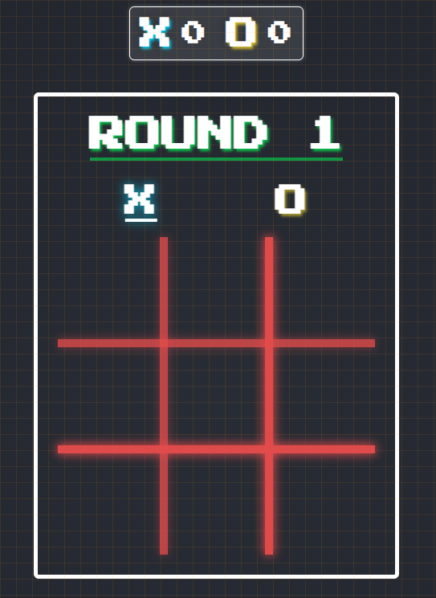

# React Tic-Tac-Toe App 🎲



This project features the popular game Tic-Tac-Toe which has been built using React. It currently allows users to play this game with 2 players. Single player will not be available as part of the first release, but is in the pipeline once 2 player mode is complete.

## Prerequisites

Before running the React Tic-Tac-Toe App, make sure you have the following software and tools installed on your machine:

- Node.js v18.16.0 or later
- npm (Node Package Manager) - this comes bundled with Node.js
- Visual Studio Code (or any other code editor of your choice)

## Installation

To install and run the React Tic-Tac-Toe App, follow these steps:

1. Clone the repository from the `main` branch to your local machine:

```sh
git clone https://github.com/SMelidoni/react-tictactoe-app.git
```

Note: By default, the `develop` branch will be checked out. However, if you want to use the most stable version, please check out the `main` branch by running: `git checkout main`

2. Navigate into the project directory:

```sh
cd react-tictactoe-app
```

3. Install the dependencies:

```sh
npm install
```

4. Run the application:

```sh
npm start
```

You can then access the application by opening your web browser and navigating to `http://localhost:3000`.

## Usage

To use the tic-tac-toe app, follow these steps:

### 2 Player Mode

1. Launch the app and select the "2 Player" mode from the main menu.
2. Player 1 (X) and Player 2 (O) will take turns selecting an empty cell on the grid.
3. To make a move, click on the desired empty cell.
4. The game will continue until one player wins by aligning three of their symbols (X or O) in a row, column, or diagonal, or until the board is full and the game ends in a draw.
5. At the end of the game, the app will display the result (win, lose, or draw) and reward the winner with one point. A new round will then begin.

### Single Player Mode (Coming Soon)

The Single Player Mode is currently under development and will be available in a future update. In this mode, you will be able to play against an AI opponent with various difficulty levels, providing a challenging and enjoyable experience.

## Contributing

If you would like to contribute to this project, please follow these steps:

1. Fork the repository
2. Create a new feature branch `git checkout -b feature/new-feature`
3. Make your changes
4. Commit your changes: `git commit -am 'Add some feature'`
5. Push the branch: `git push origin feature/new-feature`
6. Submit a pull request

Thank you for checking out the React Tic-Tac-Toe App!
